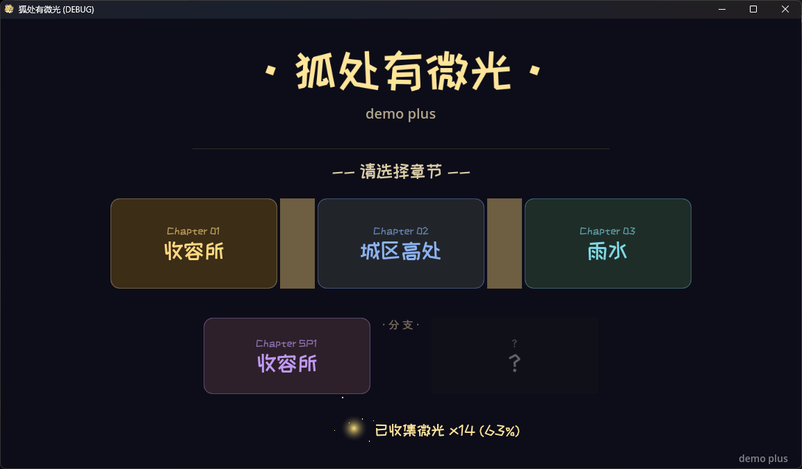
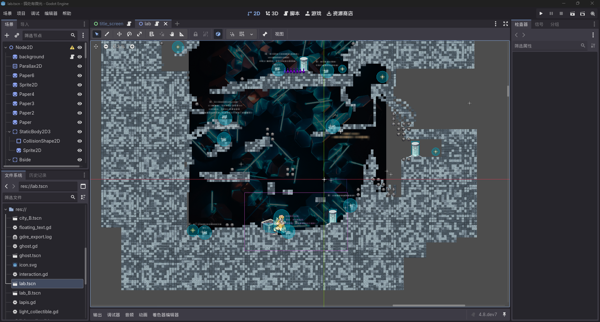

# HuChuYouWeiGuangDEMO

## 仓库的内容直述
> 

> 该仓库仅用于用于存储由 ”漂流“ 制作的 ”狐处有微光“ 游戏源代码

## 游戏开发环境直述
> 

> 该游戏由Godot4.5+开发，支持使用Godot编辑

## 其他
> 以下是参与者：
>> - 创作者首页：[漂流](https://space.bilibili.com/563225590)
>> - 仓库作者：[莫因子于L3](https://space.bilibili.com/1662847042)
>> - 创作者QQ：3648547299
>> - 仓库作者QQ：1763523596
> **群聊：1090924856**

**游戏源代码将在游戏发布的3天后同步到该仓库**

## 版本
1. **Plus版**（当前正在更新）
2. SP版（暂停更新）
3. 单机版（暂停更新）
> 旧的游戏版本将不会保留在源代码中，但是你可以在发行版中寻找旧版

***开源协议：MIT***
> 你可以下载代码修改

**其他的资源都可以在Releases里面下载**
